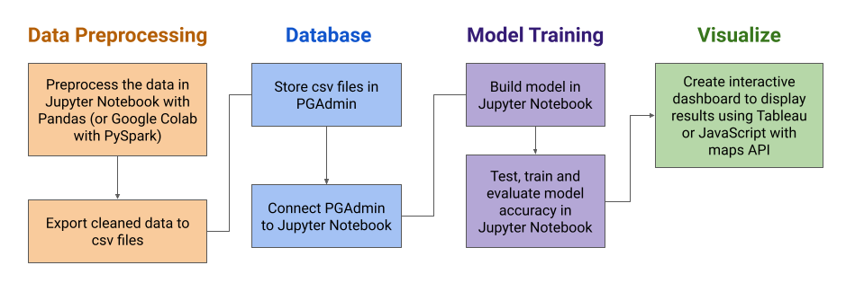
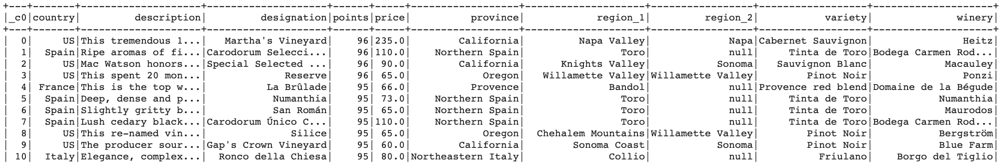
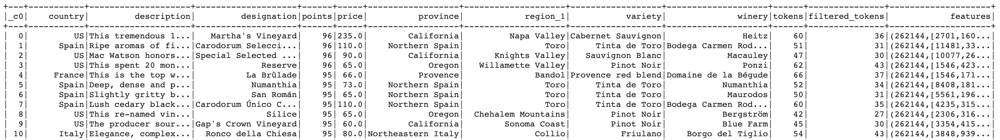
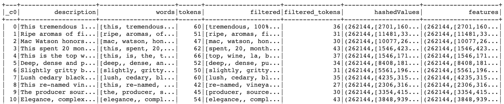
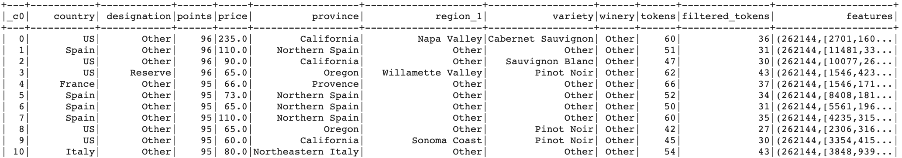
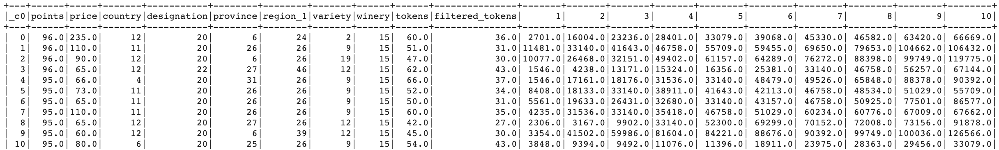
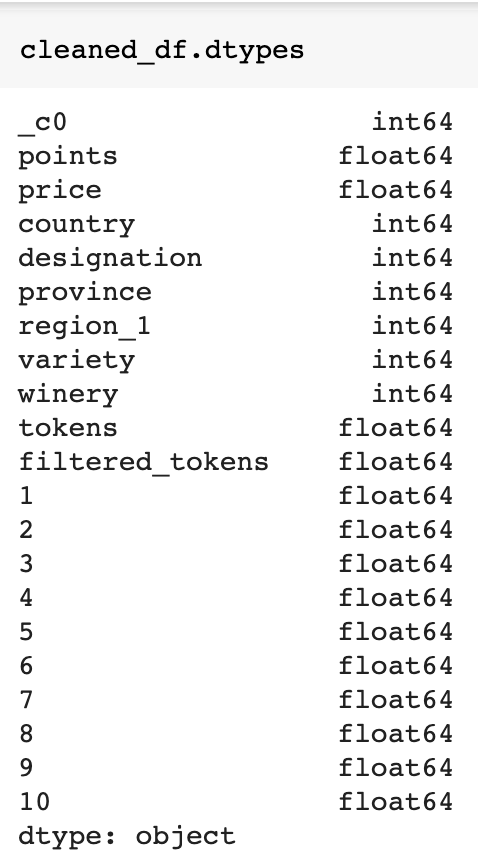

# Whats_In_A_Bottle
Group project to determine how which wines are good based on consumer reports and contents of the wine

## Goals:
*Basic* - Build a machine learning model that can predict wine quality based on the wine’s description, year, variety, region, and consumer reports.
 
*Intermediate goal*- give recommendations of wines based on specific variables (e.g. “based on the description/details of this wine, this region would be preferred”)
 
*Advanced goal*- locate similar wines nearby that the user can purchase (e.g. “you can buy this wine at the 7/11 around the corner”)
 
#### Steps to Achieve Goals:
*Basic Goal:*
- Retrieve and clean data
- Train models
- Visualize data of wine contents and consumer reports of wine
 
*Intermediate goal*
- Write for loops (or other functions that are better) that will give list of similar wines
    - Example: For wine in wine_list:
        If region is x% of wine,
        If designation is y% of wine, etc etc,
        Then add wine to recommended_list
        Print(recommended_list)
    
- Train a model on the wine magazine top 150K wines list and provide recommendations for wines from the wine variety csv files.
 
*Advanced goal*
- Use javascript/html using sales data from wine vendors to map out vendors selling recommended wines in given region (would require input from user)

#### Communication Protocols
Each team member has an individual GitHub branch. When a branch is ready to be merged with the main branch, team members will create a pull request. The Square role will review and approve all pull requests. 

Slack is used for discussions about project planning and excecution.

#### Roles
- Square: Chelsea
- Triangle: Paige
- Circle: Gina
- X: Jess

## Model Development Outline
Outline of the resources and technologies that will be used during this project. Subject to change.

## Data
#### S3 Files
* Raw Data File: [winemag-data_first150k.csv](https://whats-in-a-bottle.s3-us-west-1.amazonaws.com/winemag-data_first150k.csv)
    

* Rescaled Data File: [winemag-data_rescaled.csv](https://whats-in-a-bottle.s3-us-west-1.amazonaws.com/winemag-data_rescaled.csv)
    * This file contains the [features] values generated by tokenizing, filtering, and hashing the [description] column. Column [region_2] was dropped and null values in the [designation] and [region_1] columns were replaced with "N/A". Remaining rows with null values were then removed.
    

* Description NLP File: [winemag-data_descriptionNLP.csv](https://whats-in-a-bottle.s3-us-west-1.amazonaws.com/winemag-data_descriptionNLP.csv)
    * This file contains only information relating to the description natural language processing (NLP) pipeline.
    

* Binned Data File: [winemag-data_binned.csv](https://whats-in-a-bottle.s3-us-west-1.amazonaws.com/winemag-data_binned.csv)
    * This file contains the information for the rescaled data file, but the categorical columns have been binned to reduce the number of unique values in each column.
    

* **Cleaned Data File:** [winemag-data_cleaned.csv](https://whats-in-a-bottle.s3-us-west-1.amazonaws.com/winemag-data_cleaned_primaryKey.csv)
    * **Download this file to use for model training**
    * All columns have been converted to numeric data types and categorical columns have been encoded with the label encoder. The first column [_c0] is the primary key that connects the cleaned data back to the original data. Additionally, the [features] column, which originally contained a list of lists in each row, have been separated so that each number is now in it's own column. The top ten words for each wine were kept for model training:
    
    

#### Data Preprocessing 
1. Check the null values in each column and drop columns with large number of null values (>50% null)
2. Fill null values for columns we want to keep with "N/A", then drop remaining rows with null values
3. NLP Pipeline - Transform the description column to numeric: 
      a) Tokenize the description column 
      b) Remove Stop words from the tokenized description 
      c) Count the number of tokens and add a new column to the df 
      d) Encode the filtered description tokens 
4. Bin data in categorical columns with more than X unique values
5. Encode the categorical columns with the Label Encoder
6. Check the final cleaned dataframe for missing data or null values
7. Export the dataframe as a csv file and store in database
