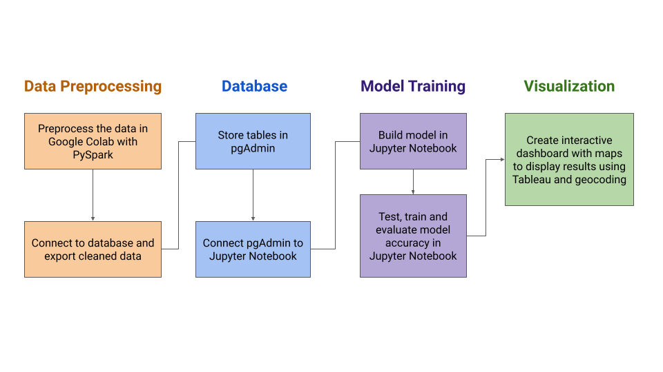
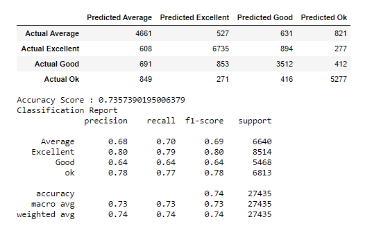

# Whats_In_A_Bottle

### Question: Can a machine learning model be able to predict the quality, price, region, and type of of wine based on the descriptive words and other characteristics? 

## Approach: 

### Model Development Outline
Outline of the resources and technologies that will be used during this project. Subject to change.

### Data
#### Data Preprocessing 

Many, if not all, of the columns had many null values. Columns that had more than 50% than null values were dropped while the rest of the columns' null values were replaced as "N/A". This cleaned data was then futhered processed using the Natural Language Processing (NLP) by first tokenizing the description column and removing the stop words. The tokens were then counted and added to a new column. This counted token column was then encoded and binned into categorical columns with more than X unique values. This final dataframe was then checked for missing or null values and exported as a csv file to be stored in databases. Below are checkpoint files for each stop of cleaning and processing the data. 

##### S3 Files
During the preprocessing and cleaning, data was saved as csv files in s3 at multiple steps for checkpointing. If one step of the preprocessing needs to be adjusted, a checkpoint file can be imported so that the entire process does not need to be run each time. 

* Raw Data File: [winemag-data_first150k.csv](https://whats-in-a-bottle.s3-us-west-1.amazonaws.com/winemag-data_first150k.csv)
    

* Rescaled Data File: [winemag-data_rescaled.csv](https://whats-in-a-bottle.s3-us-west-1.amazonaws.com/winemag-data_rescaled.csv)
    * This file contains the [features] values generated by tokenizing, filtering, and hashing the [description] column. Column [region_2] was dropped and null values in the [designation] and [region_1] columns were replaced with "N/A". Remaining rows with null values were then removed.
    

* Description NLP File: [winemag-data_descriptionNLP.csv](https://whats-in-a-bottle.s3-us-west-1.amazonaws.com/winemag-data_descriptionNLP.csv)
    * This file contains only information relating to the description natural language processing (NLP) pipeline.
    

* Binned Data File: [winemag-data_binned.csv](https://whats-in-a-bottle.s3-us-west-1.amazonaws.com/winemag-data_binned.csv)
    * This file contains the information for the rescaled data file, but the categorical columns have been binned to reduce the number of unique values in each column.
    

* **Cleaned Data File:** [winemag-data_cleaned.csv](https://whats-in-a-bottle.s3-us-west-1.amazonaws.com/winemag-data_cleaned_primaryKey.csv)
    * All columns have been converted to numeric data types and categorical columns have been encoded with the label encoder. The first column [_c0] is the primary key that connects the cleaned data back to the original data. Additionally, the [features] column, which originally contained a list of lists in each row, have been separated so that each number is now in it's own column. The top ten words for each wine were kept for model training:
    
    
    
### Machine Learning Models
#### Machine Learning Process 

Since the data was pretty clean due to the previous step of organizing and cleaning the data, there was very little additional cleaning the data for the machine learning model. The machine model chosen was a decision tree classifer, with a training set of 80% of the data. This particular machine model was used since it... 

For all machine models, any qualitative data was transformed into quantitaive data (Example??). Then some of the data was binned into different categories. For example, the points system were ranked from 80-100. Using quartitle ranges, we could split the points into different qualitative groups (e.g. 90-100 points meant that the wine was "excellent"). This can be seen below. 

The prices were also re-ranked in a similar fashion.  Original prices noted spanned from $4 to $$2,300.  The new rating was determined and assigned per the following:

The final model we decided to run had 'Countries' as the target set.  The original data contained 13 countries; all countries were retained and labeled 0 to 12 in alphabetical order.  

## Machine Learning Model Results:

## Wine Trends by Points:

## Wine Trends by Price:

## Wine Trends by Country:

## Wine Trends by Country (second model):
It was decided to run the Country model again after dropping all location specific data - as these features had over 85% weight and resulted in a 97% accuracy, 92% average precision, and 92% average recall in the original Country model. The following shows the results after dropping location specific data:

### Features most used in each model 

Reviewing the features in the models we can see the top features were often price and/or points. However, there seemed to be some instances where each model used some descriptive words in the machine models. 

### Presentation 
Link to our presentation is here: [Presentation](https://docs.google.com/presentation/d/1aN5FHNQKAEwrTPdRT2I2oPqPI9kFkRrMUlFERHwxtSA/edit#slide=id.gd6b93f1566_0_0)
The presentation also shows some word cloud visualizations of each category of wines (e.g. "top shelf", "expensive", "good", etc etc). 
You can see that each group has different words used to descripe that them, which is an interesting trend to see that you do not see within the machine models. 

### Tableau 
Some visuals for the project, such as seeing what each country's wine quality or price is grouped, can be seen on tableau here: [Tableau](https://public.tableau.com/profile/paige.spiller#!/vizhome/WineryLocations_16198920961010/WhatsinaBottleStory)

