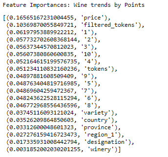

# Whats_In_A_Bottle
Group project to determine how which wines are good based on consumer reports and contents of the wine

## Machine Learning Model:

### Description of preliminary data preprocessing
(on main branch)

### Description of preliminary feature engineering and preliminary feature selection, including the decision-making process
#### 1. Any qualitative data was transformed to quantitative
#### 2. points were ranked from 80-100; since this was used as the target set on the initial model, we decided to assign a new rating in order to simplify.  The new rating was determined on the points quartile ranges as noted below:

#### The prices were also re-ranked in a similar fashion.  Original prices noted spanned from $4 to $$2,300.  The new rating was determined and assigned per the following:

#### The final model we decided to run had 'Countries' as the target set.  The original data contained 13 countries; all countries were retained and labeled 0 to 12 in alphabetical order.  

### Description of how data was split into training and testing sets
#### training size = .8 (will add more)

### Explanation of model choice, including limitations and benefits
#### Decision Tree Classifier (will add more)

### how does the model address the initial question?
(will add more)

## Machine Learning Model Results:

## Wine Trends by Points:

## Wine Trends by Price:

## Wine Trends by Country:

## Wine Trends by Country (second model):

